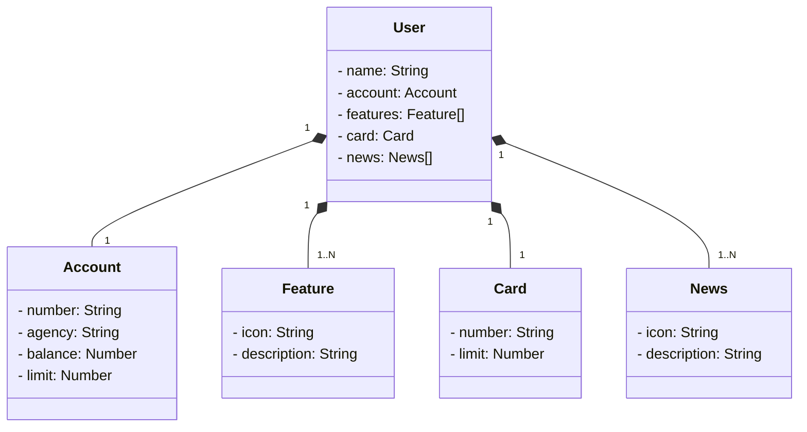

# API-REST-Deploy_Aula
### do curso "Publicando Sua API REST na Nuvem Usando Spring Boot 3, Java 17 e Railway".
disponibilizado pelo programa de bolsas Santander.

## Diagrama de classes:

```mermaid
classDiagram
  class User {
    - name: String
    - account: Account
    - features: Feature[]
    - card: Card
    - news: News[]
  }
  
  class Account {
    - number: String
    - agency: String
    - balance: Number
    - limit: Number
  }
  
  class Feature {
    - icon: String
    - description: String
  }
  
  class Card {
    - number: String
    - limit: Number
  }
  
  class News {
    - icon: String
    - description: String
  }
  
  User "1" *-- "1" Account
  User "1" *-- "1..N" Feature
  User "1" *-- "1" Card
  User "1" *-- "1..N" News

```
